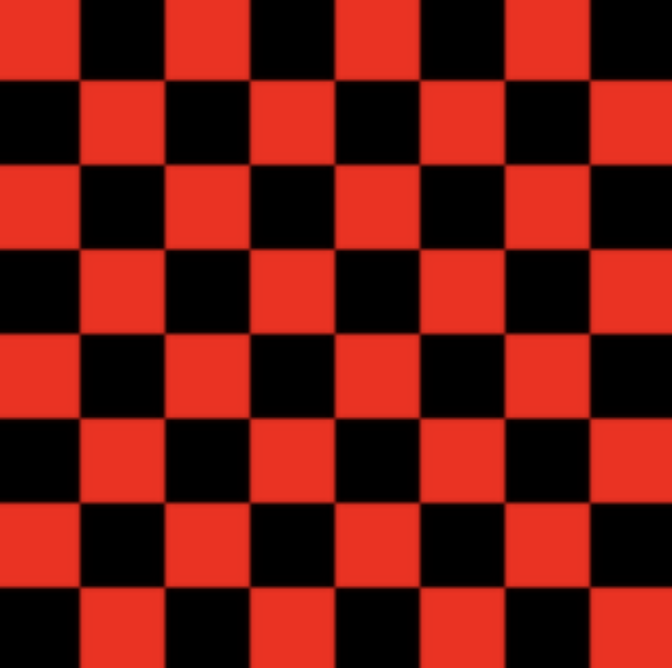
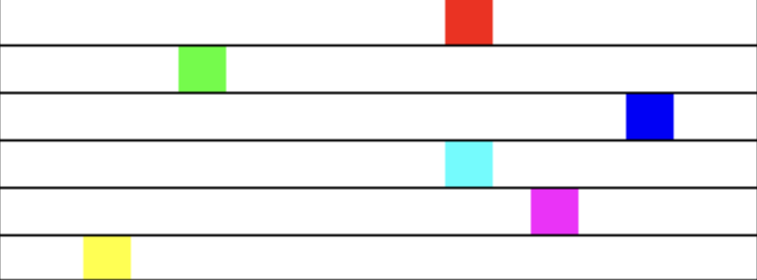

= Programming Exercises for Chapter 3

* Exercise 3.1:
** How many times do you have to roll a pair of dice before they come up snake eyes? You could do the experiment by rolling the dice by hand. 
** Write a computer program that simulates the experiment. The program should report the number of rolls that it makes before the dice come up snake eyes. + 
(Note: "Snake eyes" means that both dice show a value of 1.) Exercise 2.2 explained how to simulate rolling a pair of dice.

---

* Exercise 3.2:
** Which integer between 1 and 10000 has the largest number of divisors, and how many divisors does it have? Write a program to find the answers and print out the results. It is possible that several integers in this range have the same, maximum number of divisors. Your program only has to print out one of them. 
** You might need some hints about how to find a maximum value. The basic idea is to go through all the integers, keeping track of the largest number of divisors that you've seen so far. Also, keep track of the integer that had that number of divisors.

---

* Exercise 3.3:
** Write a program that will evaluate simple expressions such as 17 + 3 and 3.14159 * 4.7. The expressions are to be typed in by the user.
** The input always consists of a number, followed by an operator, followed by another number. The operators that are allowed are +, -, *, and /. 
** You can read the numbers with `TextIO.getDouble()` and the operator with `TextIO.getChar()`. Your program should read an expression, print its value, read another expression, print its value, and so on. 
** The program should end when the user enters 0 as the first number on the line.

---

* Exercise 3.4:
** Write a program that reads one line of input text and breaks it up into words. The words should be output one per line. A word is defined to be a sequence of letters. 
** Any characters in the input that are not letters should be discarded. For example, if the user inputs the line

    He said, "That's not a good idea."

** then the output of the program should be

    He
    said
    That
    s
    not
    a
    good
    idea

** An improved version of the program would list "that's" as a single word. An apostrophe can be considered to be part of a word if there is a letter on each side of the apostrophe.
** To test whether a character is a letter, you might use `(ch >= 'a' && ch <= 'z') || (ch >= 'A' && ch <= 'Z')`. However, this only works in English and similar languages. A better choice is to call the standard function `Character.isLetter(ch)`, which returns a boolean value of true if ch is a letter and false if it is not. This works for any Unicode character.

---

* Exercise 3.5:
** Suppose that a file contains information about sales figures for a company in various cities. Each line of the file contains a city name, followed by a colon (:) followed by the data for that city. 
** The data is a number of type double. However, for some cities, no data was available. In these lines, the data is replaced by a comment explaining why the data is missing. For example, several lines from the file might look like:

    San Francisco:  19887.32
    Chicago:  no report received
    New York: 298734.12

** Write a program that will compute and print the total sales from all the cities together. The program should also report the number of cities for which data was not available. The name of the file is "sales.dat".
** Suggestion: For each line, read and ignore characters up to the colon. Then read the rest of the line into a variable of type `String`. Try to convert the string into a number, and use try-catch to test whether the conversion succeeds.

---

* Exercise 3.6:
** Exercise 3.2 asked you to find the number in the range 1 to 10000 that has the largest number of divisors. You only had to print out one such number. Revise the program so that it will print out all numbers that have the maximum number of divisors. 
** Use an array as follows: As you count the divisors for each number, store each count in an array. Then at the end of the program, you can go through the array and print out all the numbers that have the maximum count. 
** The output from the program should look something like this:

    Among integers between 1 and 10000,
    The maximum number of divisors was 64
    Numbers with that many divisors include:
    7560
    9240

---

* Exercise 3.7:
** How many random people do you have to select before you find a duplicate birthday?
*** How many random people do you have to select before you find three people who share the same birthday? (That is, all three people were born on the same day in the same month, but not necessarily in the same year.)
*** Suppose you choose 365 people at random. How many different birthdays will they have? (The number could theoretically be anywhere from 1 to 365).
*** How many different people do you have to check before you've found at least one person with a birthday on each of the 365 days of the year?

** Write three programs to answer these questions. Each of your programs should simulate choosing people at random and checking their birthdays. (In each case, ignore the possibility of leap years.)

---

* Exercise 3.8:
** The checkerboard should be 400-by-400 pixels. You can change the size of the drawing area in `SimpleGraphicsStarter.java` by modifying the first two lines of the `start()` subroutine to set `width` and `height` to 400 instead of 800 and 600. A checkerboard contains 8 rows and 8 columns of squares. If the size of the drawing area is 400, that means that each square should be 50-by-50 pixels. 
** The squares are red and black (or whatever other colors you choose). Here is a tricky way to determine whether a given square should be red or black: The rows and columns can be thought of as numbered from 0 to 7. If the row number of the square and the column number of the square are either both even or both odd, then the square is red. 
** Otherwise, it is black. Note that a square is just a rectangle in which the `height` is equal to the `width`, so you can use the subroutine `g.fillRect()` to draw the squares. 
** Here is a reduced-size image of the checkerboard that you want to draw:

---

* Exercise 3.9:

** Often, some element of an animation repeats over and over, every so many frames. Sometimes, the repetition is "cyclic," meaning that at the end it jumps back to the start. Sometimes the repetition is "oscillating," like a back-and-forth motion where the second half is the same as the first half played in reverse.

** Write an animation that demonstrates both cyclic and oscillating motions at various speeds. For cyclic motion, you can use a square that moves across the drawing area, then jumps back to the start, and then repeats the same motion over and over. For oscillating motion, you can do something similar, but the square should move back and forth between the two edges of the drawing area; that is, it moves left-to-right during the first half of the animation and then backwards from right-to-left during the second half. 

** A cyclic motion has to repeat every N frames for some value of N. What you draw in some frame of the animation depends on the `frameNumber`. The `frameNumber` just keeps increasing forever. To implement cyclic motion, what you really want is a "cyclic frame number" that takes on the values `0, 1, 2, ..., (N-1), 0, 1, 2, ..., (N-1), 0, 1, 2, ....` You can derive the value that you need from `frameNumber` simply by saying

    cyclicFrameNumber = frameNumber % N;

** Then, you just have to base what you draw on cyclicFrameNumber instead of on frameNumber. Similarly, for an oscillating animation, you need an "oscillation frame number" that takes on the values `0, 1, 2, ... (N-1), N, (N-1), (N-2), ... 2, 1, 0, 1, 2, ` and so on, repeating the back and forth motion forever. You can compute the value that you need with

    oscilationFrameNumber = frameNumber % (2*N);
    if (oscillationFrameNumber > N)
    oscillationFrameNumber = (2*N) - oscillationFrameNumber;

** Here is a screen shot from my version of the program. I use six squares. The top three do cyclic motion at various speeds, while the bottom three do oscillating motion. I drew black lines across the drawing area to separate the squares and to give them "channels" to move in.

