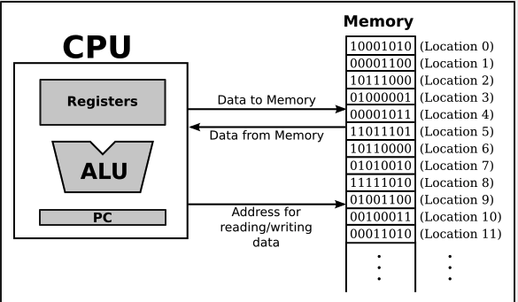
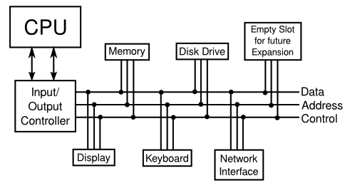
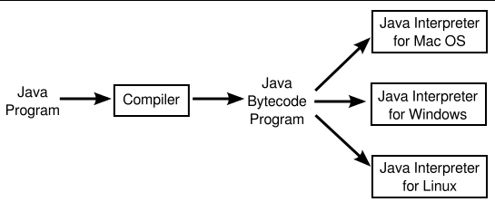
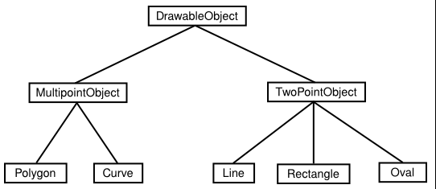

# Unit 1 정신적 지형

## 가져오기와 실행주기 : 기계어

- CPU의 역할은 프로그램을 실행시키는 것
- 프로그램은 컴퓨터에 의해 기계적으로 따르도록 의도된 명령목록
- 컴퓨터는 기계어로 작성된 명령을 수행하도록 구성
- CPU가 프로그램을 실행할 때 해당 프로그램은 주 메모리에 저장
- 실행주기란 명령을 가져오고 실행하는 것을 반복하는 것
- ALU란 덧셈과 뺄셈과 같은 작업을 수행하는 프로세스의 일부
- 기계어 명령은 이진 숫자로 표현됨, 0 또는 1비트
- 메모리 위치는 8개의 비트로 이루어진 바이트를 보유

## 비동기 이벤트 :  폴링루프와 인터럽트
- 시스템에 새 기기를 설치하는 과정
  1. 기기를 물리적으로 연결
  2. 기기 드라이버 소프트웨어 설치 - 드라이버가 없으면 CPU가 해당 기기와 통신할 수 없다.

- 폴링이란 CPU가 계속해서 입력 데이터가 있는지 확인하기 위해 입력 장치를 지속적으로 검사하는 것
- 폴링은 매우 간단하지만 매우 비효율적이다
- 이러한 비효율성을 피하기 위해 인터럽트가 일반적으로 사용
- 인터럽트는 다른 기기에서 CPU로 보내는 신호입니다.
- 예를 들면 키보드에서 키를 누르면 키보드 인터럽트가 CPU로 전송되고 CPU는 이 신호에 응답하여 현재 수행중인 작업을 중단하고 누른 키를 읽어들이고 처리한 다음 누르기 전에 수행하던 작업으로 돌아간다.
- 인터럽트는 CPU가 비동기적 이벤트 또는 예측할 수 없는 시간에 발생하는 이벤트를 효율적으로 처리할 수 있게 한다.
- CPU가 작업 중인 개별 작업을 쓰레드라고 합니다.
- 많은 CPU는 실제로 하나의 쓰레드 이상을 동시에 실행할 수 있습니다.
- CPU는 각각이 하나의 쓰레드를 실행할 수 있는 여러 "코어"를 포함합니다.
- 인터럽트 처리를 모두 수행하는 소프트웨어를 운영 체제라고 합니다.

## 자바 가상 머신

- 고급 언어로 작성된 프로그램은 어떤 컴퓨터에서도 직접 실행될 수 없습니다. 먼저 머신 언어로 변환되어야 합니다.
- 이 변환은 컴파일러라는 프로그램을 사용하여 수행할 수 있습니다. 
- 번역이 완료되면 머신 언어 프로그램은 여러 번 실행될 수 있지만 물론 하나의 유형의 컴퓨터에서만 실행될 수 있습니다. 왜냐하면 각 유형의 컴퓨터는 고유한 머신 언어를 갖기 때문입니다.
- 동일한 컴파일된 프로그램을 여러 가지 다른 유형의 컴퓨터에서 실행할 수 있습니다.

## 프로그램의 기본 구성 요소

- 프로그래밍에는 데이터와 명령어라는 두 가지 기본 측면이 있습니다. 
- 데이터를 다루려면 변수와 유형을 이해해야 하며, 명령어를 다루려면 제어 구조와 서브루틴을 이해해야 합니다
- 변수는 프로그램에서 쉽게 참조하고 사용할 수 있도록 이름이 지정된 메모리 위치(또는 연속된 여러 위치)일 뿐입니다.

## 객체와 객체지향프로그래밍

- 객체가 동일한 메시지에 서로 다르게 응답할 수 있다는 이 특성을 다형성이라고 합니다.

